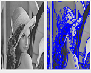

Resume
---
###  한림대학교 소프트웨어대학 컨텐츠 IT, 디지털인문예술 전공
#### 20185162 전유빈 (Jennifer Jeon)
* * *
######  H.P : 010-8668-3917
######  E-mail : fligger515@gmail.com
######  GitHub 주소 : <https://github.com/fligger515>
* * *
###### Interested at : Computer Graphics / VR / Game Design / Charagter Design
 |   |  
##### Skills - JAVA, C, Unix Shell

 2018. 2. 26 한림대학교 입학

           소프트웨어 중심대학 홍보 동아리 'SWID'의 동아리 운영

           소프트웨어대학(구 컴퓨터공학과) 학생회 임원 - 기획국

           학술동아리 '씨애랑' 동아리원
           
 2018. 11. 23
           현재 한림대학교 Software Week 중 열리는 SW 전시회에 출품할 작품 제작 중
           ('DukeAdventure' 게임)
* * *
#### 앞으로의 목표
           컨텐츠 IT와 디지털인문예술을 복수 전공하며 다양한 방향으로 나갈 수 있도록 함.
           웹디자이너 또는 게임 디자이너로 활동 희망
